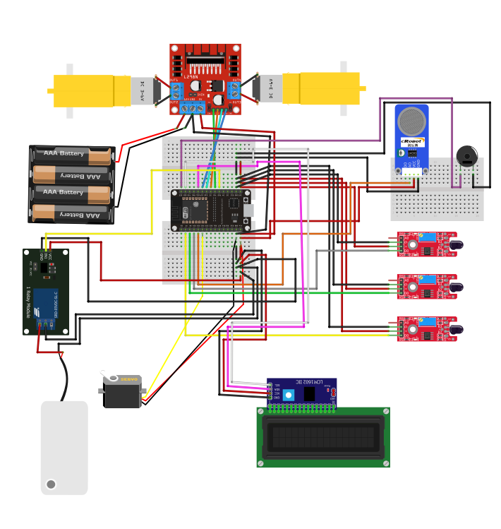

# Firefighter Robot

This project is a fire detection and extinguishing robot built using an ESP32 microcontroller. 
The robot is capable of detecting fire using flame sensors, moving toward the fire, triggering an alert via a buzzer, 
displaying information on an LCD screen, and using a servo to simulate extinguishing the fire (controlling a water pump). 

## Features
- **Fire Detection**: Uses three flame sensors to detect the location of the fire.
- **Movement Control**: Robot moves forward, left, or right based on the flame sensor input.
- **Fire Extinguishing**: When fire is detected, the robot stops and moves a servo to simulate extinguishing the fire.
- **Smoke Detection**: Monitors for the presence of smoke using a smoke sensor.
- **Alert System**: Activates a buzzer when fire is detected.
- **LCD Display**: Shows messages such as "Fire Detected" or "All Clear" on an LCD screen.

## Components Used
- **ESP32**: Main microcontroller to control the robot.
- **Servo Motor**: Controls the simulated extinguishing mechanism (water pump).
- **Flame Sensors**: Detect fire on the left, center, and right sides.
- **DC Motors**: Move the robot in various directions (forward, backward, left, and right).
- **Motor Driver (L298N)**: Drives the DC motors.
- **Smoke Sensor**: Detects smoke levels in the area.
- **Buzzer**: Alerts when fire is detected.
- **Water Pump**: Pumps water to extinguish the fire.
- **Tube Pipe**: Used to direct water from the pump to the fire for extinguishing purposes.
- **Relay**: Can be used to control the water pump or other high-current devices.
- **LCD Display (I2C)**: Displays status messages such as fire detection and extinguishing status.

## Circuit

